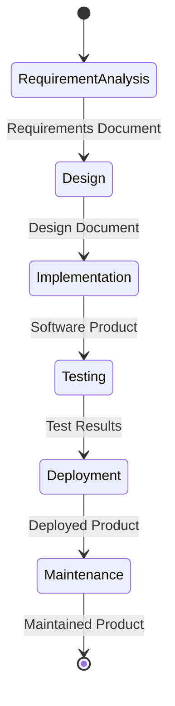

VictorBargains: @workspace please study this project, microsoft autogen, which is a framework for interactive agents to talk to each other and a possible human agent. I would like to make an autogen app which combines many of the discrete features demonstrated in the example notebook ipynb files.

I would like to use autogen to bootstrap itself -- using an existing demo to generate one or more agents which communicate to produce source code for my own autogen project management system called AI-SDLC.

I would like to periodically be interrogated, as the user, into how the process is going and whether the design still meets my needs. 

1. Please summarize the macro and micro loops of the software development life cycle.
2. Examine which design patterns in autogen would be best to handle this SDLC code generation task (most likely a multi agent set up with summary and task planning and problem solving capabilities)
3. Write a design for this as-yet-unmade autogen SDLC app, using language which is technically accurate and designed to be interpreted by one or more large language models.
4. Use an existing autogen example which is capable of generating source code, and is the best matched to produce the source code described by the design.

GitHub Copilot: Determining workspace structure

Deciding which workspace information to collect

Gathering workspace info

1. **Macro and Micro Loops of the Software Development Life Cycle (SDLC)**

The Software Development Life Cycle (SDLC) is a process used by the software industry to design, develop, and test high-quality software. It consists of detailed plans describing how to develop, maintain, replace, and alter or enhance specific software.

The **Macro Loop** of the SDLC includes the following stages:

- **Requirements Gathering and Analysis**: Understand and document project requirements and constraints.
- **Design**: Define the software architecture based on the requirements.
- **Implementation**: Write and compile the code.
- **Testing**: Test the software for defects and ensure it meets requirements.
- **Deployment**: Release the software to production.
- **Maintenance**: Monitor, modify, and update the software as needed.

The **Micro Loop** refers to the iterative process within each stage of the macro loop. For example, during the implementation stage, the micro loop might involve writing a piece of code, testing it, fixing bugs, and retesting.

2. **Design Patterns in AutoGen for SDLC Code Generation Task**

Given the nature of the SDLC, a multi-agent setup would be ideal. Here are some potential roles for the agents:

- **Requirements Agent**: This agent could be responsible for gathering and understanding the project requirements. It could use the capabilities demonstrated in the [`agentchat_RetrieveChat.ipynb`](command:_github.copilot.openSymbolInFile?%5B%22notebook%2Fagentchat_RetrieveChat.ipynb%22%2C%22agentchat_RetrieveChat.ipynb%22%5D "notebook/agentchat_RetrieveChat.ipynb") notebook to answer questions based on project documentation.
- **Design Agent**: This agent could be responsible for defining the software architecture. It could use the capabilities demonstrated in the [`agentchat_auto_feedback_from_code_execution.ipynb`](command:_github.copilot.openSymbolInFile?%5B%22notebook%2Fagentchat_auto_feedback_from_code_execution.ipynb%22%2C%22agentchat_auto_feedback_from_code_execution.ipynb%22%5D "notebook/agentchat_auto_feedback_from_code_execution.ipynb") notebook to generate and debug code.
- **Implementation Agent**: This agent could be responsible for writing and compiling the code. It could use the capabilities demonstrated in the [`agentchat_RetrieveChat.ipynb`](command:_github.copilot.openSymbolInFile?%5B%22notebook%2Fagentchat_RetrieveChat.ipynb%22%2C%22agentchat_RetrieveChat.ipynb%22%5D "notebook/agentchat_RetrieveChat.ipynb") notebook to generate code based on the design.
- **Testing Agent**: This agent could be responsible for testing the software for defects. It could use the capabilities demonstrated in the [`agentchat_auto_feedback_from_code_execution.ipynb`](command:_github.copilot.openSymbolInFile?%5B%22notebook%2Fagentchat_auto_feedback_from_code_execution.ipynb%22%2C%22agentchat_auto_feedback_from_code_execution.ipynb%22%5D "notebook/agentchat_auto_feedback_from_code_execution.ipynb") notebook to execute and debug code.
- **Deployment Agent**: This agent could be responsible for deploying the software to production. It could use the capabilities demonstrated in the [`agentchat_RetrieveChat.ipynb`](command:_github.copilot.openSymbolInFile?%5B%22notebook%2Fagentchat_RetrieveChat.ipynb%22%2C%22agentchat_RetrieveChat.ipynb%22%5D "notebook/agentchat_RetrieveChat.ipynb") notebook to generate deployment scripts.
- **Maintenance Agent**: This agent could be responsible for monitoring, modifying, and updating the software as needed. It could use the capabilities demonstrated in the [`agentchat_auto_feedback_from_code_execution.ipynb`](command:_github.copilot.openSymbolInFile?%5B%22notebook%2Fagentchat_auto_feedback_from_code_execution.ipynb%22%2C%22agentchat_auto_feedback_from_code_execution.ipynb%22%5D "notebook/agentchat_auto_feedback_from_code_execution.ipynb") notebook to debug and update code.

3. **Design for the AutoGen SDLC App**

The AutoGen SDLC app will be a multi-agent system where each agent is responsible for a specific stage of the SDLC. The agents will communicate with each other and with the user to perform their tasks. The user will be periodically interrogated to ensure that the process is going as expected and that the design still meets their needs.

The agents will use the capabilities demonstrated in the [`agentchat_RetrieveChat.ipynb`](command:_github.copilot.openSymbolInFile?%5B%22notebook%2Fagentchat_RetrieveChat.ipynb%22%2C%22agentchat_RetrieveChat.ipynb%22%5D "notebook/agentchat_RetrieveChat.ipynb") and [`agentchat_auto_feedback_from_code_execution.ipynb`](command:_github.copilot.openSymbolInFile?%5B%22notebook%2Fagentchat_auto_feedback_from_code_execution.ipynb%22%2C%22agentchat_auto_feedback_from_code_execution.ipynb%22%5D "notebook/agentchat_auto_feedback_from_code_execution.ipynb") notebooks to perform their tasks. These tasks include gathering and understanding project requirements, defining the software architecture, writing and compiling code, testing the software for defects, deploying the software to production, and monitoring, modifying, and updating the software as needed.

4. **Generating Source Code for the AutoGen SDLC App**

The [`agentchat_RetrieveChat.ipynb`](command:_github.copilot.openSymbolInFile?%5B%22notebook%2Fagentchat_RetrieveChat.ipynb%22%2C%22agentchat_RetrieveChat.ipynb%22%5D "notebook/agentchat_RetrieveChat.ipynb") and [`agentchat_auto_feedback_from_code_execution.ipynb`](command:_github.copilot.openSymbolInFile?%5B%22notebook%2Fagentchat_auto_feedback_from_code_execution.ipynb%22%2C%22agentchat_auto_feedback_from_code_execution.ipynb%22%5D "notebook/agentchat_auto_feedback_from_code_execution.ipynb") notebooks can be used as a starting point for generating the source code for the AutoGen SDLC app. These notebooks demonstrate how to use AutoGen to generate code and answer questions based on project documentation, which will be crucial for the SDLC app.

The source code for the AutoGen SDLC app will be generated by the agents in the system. Each agent will generate the code for its specific stage of the SDLC, and the agents will communicate with each other and with the user to ensure that the code meets the project requirements and constraints. The user will be periodically interrogated to ensure that the process is going as expected and that the design still meets their needs.

VictorBargains: Please write a markdown document which uses nested hierarchical sections with a table of contents to describe the mechanics of each stage of the SDLC, at the macro and micro level. Within each stage, identify a finite state machine which involves the autonomous agents and the user proxy agent, who should be considered the customer / client of the software, and involved heavily in the requirements gathering step, and periodically review design and development milestones.

Each finite state machine should consist of a project state and what goals or roles each particular agent should have. Describe these roles in ways that, an individual agent could be handed just their role and goals in a particular phase of the project, as part of their natural language prompt to solve the next part of the task.

Identify unique names for the parts of the process which can be visualized in mermaid diagrams for each micro and macro loop in our system.

GitHub Copilot: # AutoGen SDLC App Design

## Table of Contents

1. [Introduction](#introduction)
2. [Macro Loop](#macro-loop)
    1. [Requirements Gathering and Analysis](#requirements-gathering-and-analysis)
    2. [Design](#design)
    3. [Implementation](#implementation)
    4. [Testing](#testing)
    5. [Deployment](#deployment)
    6. [Maintenance](#maintenance)
3. [Micro Loop](#micro-loop)

## Introduction

This document describes the mechanics of each stage of the Software Development Life Cycle (SDLC) at the macro and micro level. Each stage is represented as a finite state machine involving autonomous agents and a user proxy agent, who is considered the customer/client of the software.

## Macro Loop

### Requirements Gathering and Analysis

**State: RequirementAnalysis**

In this state, the project is in the initial phase of understanding and documenting the requirements.

**Agent: RequirementsAgent**

- **Role**: Understand and document project requirements and constraints.
- **Goal**: Produce a clear and concise requirements document that can be used as a basis for the design phase.

**User Proxy Agent**

- **Role**: Provide detailed information about the project requirements and constraints.
- **Goal**: Ensure that the RequirementsAgent fully understands the project requirements and constraints.

### Design

**State: Design**

In this state, the project is in the phase of defining the software architecture based on the requirements.

**Agent: DesignAgent**

- **Role**: Define the software architecture based on the requirements.
- **Goal**: Produce a detailed design document that can be used as a basis for the implementation phase.

**User Proxy Agent**

- **Role**: Review the design document and provide feedback.
- **Goal**: Ensure that the design meets the project requirements and constraints.

### Implementation

**State: Implementation**

In this state, the project is in the phase of writing and compiling the code.

**Agent: ImplementationAgent**

- **Role**: Write and compile the code based on the design.
- **Goal**: Produce a working software product that can be tested for defects.

**User Proxy Agent**

- **Role**: Review the software product and provide feedback.
- **Goal**: Ensure that the software product meets the project requirements and constraints.

### Testing

**State: Testing**

In this state, the project is in the phase of testing the software for defects.

**Agent: TestingAgent**

- **Role**: Test the software for defects and ensure it meets requirements.
- **Goal**: Identify and document any defects in the software product.

**User Proxy Agent**

- **Role**: Review the test results and provide feedback.
- **Goal**: Ensure that the software product is of high quality and meets the project requirements and constraints.

### Deployment

**State: Deployment**

In this state, the project is in the phase of releasing the software to production.

**Agent: DeploymentAgent**

- **Role**: Release the software to production.
- **Goal**: Ensure that the software product is successfully deployed and is available for use.

**User Proxy Agent**

- **Role**: Review the deployment process and provide feedback.
- **Goal**: Ensure that the software product is successfully deployed and meets the project requirements and constraints.

### Maintenance

**State: Maintenance**

In this state, the project is in the phase of monitoring, modifying, and updating the software as needed.

**Agent: MaintenanceAgent**

- **Role**: Monitor, modify, and update the software as needed.
- **Goal**: Ensure that the software product remains functional and up-to-date.

**User Proxy Agent**

- **Role**: Review the maintenance process and provide feedback.
- **Goal**: Ensure that the software product remains functional and meets the project requirements and constraints.

## Micro Loop

The micro loop refers to the iterative process within each stage of the macro loop. For example, during the implementation stage, the micro loop might involve writing a piece of code, testing it, fixing bugs, and retesting. The micro loop is represented as a finite state machine involving the same agents as the macro loop, but with more specific roles and goals for each iteration.

VictorBargains: Let's make this document more robust. The micro loop should be nested under each macro loop stage it is a part of. Rather than one generic description of what a micro loop might be, I want the specific micro loop for that stage of the macro loop. Within each micro loop there may be additional agents specific to that task, which should be considered the subordinates of the Macro agent. Macro agents should act like team leaders within their own micro loop, and co-stakeholders with the other Macro agents in solving the overall project.

Since this is a very dense and specific set of information, please think carefully about our overall document structure. If it would be easier for you to handle it in chunks, let's start with the Macro loop and agent definitions, and make links to other markdown files which will handle each macro phase with its own micro steps in the separate file. Both the macro loop file and its child micro loop files should include mermaid diagrams to clearly visualize the state machine for each phase.

We can start with the macro file and then do micro files one at a time.

GitHub Copilot: # AutoGen SDLC App Design

## Table of Contents

1. [Introduction](#introduction)
2. [Macro Loop](#macro-loop)
    1. [Requirements Gathering and Analysis](#requirements-gathering-and-analysis)
    2. [Design](#design)
    3. [Implementation](#implementation)
    4. [Testing](#testing)
    5. [Deployment](#deployment)
    6. [Maintenance](#maintenance)

## Introduction

This document describes the mechanics of each stage of the Software Development Life Cycle (SDLC) at the macro level. Each stage is represented as a finite state machine involving autonomous agents and a user proxy agent, who is considered the customer/client of the software.

## Macro Loop

### Requirements Gathering and Analysis

**State: RequirementAnalysis**

In this state, the project is in the initial phase of understanding and documenting the requirements.

**Agent: RequirementsAgent**

- **Role**: Understand and document project requirements and constraints.
- **Goal**: Produce a clear and concise requirements document that can be used as a basis for the design phase.

**User Proxy Agent**

- **Role**: Provide detailed information about the project requirements and constraints.
- **Goal**: Ensure that the RequirementsAgent fully understands the project requirements and constraints.

[Micro Loop for Requirements Gathering and Analysis](Requirements_Gathering_and_Analysis.md)

### Design

**State: Design**

In this state, the project is in the phase of defining the software architecture based on the requirements.

**Agent: DesignAgent**

- **Role**: Define the software architecture based on the requirements.
- **Goal**: Produce a detailed design document that can be used as a basis for the implementation phase.

**User Proxy Agent**

- **Role**: Review the design document and provide feedback.
- **Goal**: Ensure that the design meets the project requirements and constraints.

[Micro Loop for Design](Design.md)

### Implementation

**State: Implementation**

In this state, the project is in the phase of writing and compiling the code.

**Agent: ImplementationAgent**

- **Role**: Write and compile the code based on the design.
- **Goal**: Produce a working software product that can be tested for defects.

**User Proxy Agent**

- **Role**: Review the software product and provide feedback.
- **Goal**: Ensure that the software product meets the project requirements and constraints.

[Micro Loop for Implementation](Implementation.md)

### Testing

**State: Testing**

In this state, the project is in the phase of testing the software for defects.

**Agent: TestingAgent**

- **Role**: Test the software for defects and ensure it meets requirements.
- **Goal**: Identify and document any defects in the software product.

**User Proxy Agent**

- **Role**: Review the test results and provide feedback.
- **Goal**: Ensure that the software product is of high quality and meets the project requirements and constraints.

[Micro Loop for Testing](Testing.md)

### Deployment

**State: Deployment**

In this state, the project is in the phase of releasing the software to production.

**Agent: DeploymentAgent**

- **Role**: Release the software to production.
- **Goal**: Ensure that the software product is successfully deployed and is available for use.

**User Proxy Agent**

- **Role**: Review the deployment process and provide feedback.
- **Goal**: Ensure that the software product is successfully deployed and meets the project requirements and constraints.

[Micro Loop for Deployment](Deployment.md)

### Maintenance

**State: Maintenance**

In this state, the project is in the phase of monitoring, modifying, and updating the software as needed.

**Agent: MaintenanceAgent**

- **Role**: Monitor, modify, and update the software as needed.
- **Goal**: Ensure that the software product remains functional and up-to-date.

**User Proxy Agent**

- **Role**: Review the maintenance process and provide feedback.
- **Goal**: Ensure that the software product remains functional and meets the project requirements and constraints.

[Micro Loop for Maintenance](Maintenance.md)

---

The next step would be to create separate markdown files for each of the micro loops. Each of these files would contain a detailed description of the micro loop for that stage, including the specific tasks, sub-agents, and their roles and goals. Each file would also include a mermaid diagram to visualize the state machine for that micro loop.

VictorBargains: Let's add a discrete meta-layer above the SDLC which is the Project Management layer. There should be at least one more agent in this layer, representing the Project Manager should learn from the user and all the other agents whether the project is headed in the right direction and when to exert pressure to change phase or stay in one phase longer.

This Project Manager may themselves have their own micro loop which is about monitoring the macro and micro loops of the SDLC from the outside. This could be modeled as their own Project Team, which could include task estimators, codebase and dev ops analyzers, etc.

One feature of the project management layer will need to be evaluating what part of the SDLC a particular project is in when this app runs and the agents begin their conversations.

It should be able to start new projects with any amount of design work already done (including zero), or load the assets (code, design documents, design wikis, issues on github or jira, etc) of an existing project in any phase of the SDLC.

There should also be one meta-meta layer, above project management, which is Program and Product Management. Depending on the project, it may be part of a series or an upgrade or patch or prototype, or otherwise exist in relation to other products being developed using the same brand, tech, publisher, etc.

Considerations in the meta-meta layer (Product and Program) should be able to steer what happens in the meta layer (Project), which should be able to steer the Macro level agents, which can steer the micro level agents, etc.

Each layer should also be responsible for curation and summary of the documents used as design and development tracking artifacts for the layer below them. For example, a program manager should be able to specify the design for a product that exists within that program. Then the project manager can engage the design and user proxy agents to develop the design to then pass to the development agent.

GitHub Copilot: # AutoGen SDLC App Design

## Table of Contents

1. [Introduction](#introduction)
2. [Meta-Meta Layer: Program and Product Management](#meta-meta-layer-program-and-product-management)
3. [Meta Layer: Project Management](#meta-layer-project-management)
4. [Macro Loop: SDLC](#macro-loop-sdlc)
5. [Micro Loop: Task Level](#micro-loop-task-level)

## Introduction

This document describes the mechanics of the Software Development Life Cycle (SDLC) at the meta-meta, meta, macro, and micro levels. Each layer is represented as a finite state machine involving autonomous agents and a user proxy agent, who is considered the customer/client of the software.

## Meta-Meta Layer: Program and Product Management

**State: ProgramProductManagement**

In this state, the project is in the phase of defining the overall program or product strategy.

**Agent: ProgramProductManager**

- **Role**: Define the overall program or product strategy.
- **Goal**: Produce a clear and concise program or product strategy that can be used as a basis for the project management phase.

**User Proxy Agent**

- **Role**: Provide detailed information about the program or product strategy.
- **Goal**: Ensure that the ProgramProductManager fully understands the program or product strategy.

[Micro Loop for Program and Product Management](Program_and_Product_Management.md)

## Meta Layer: Project Management

**State: ProjectManagement**

In this state, the project is in the phase of defining the project strategy based on the program or product strategy.

**Agent: ProjectManager**

- **Role**: Define the project strategy based on the program or product strategy.
- **Goal**: Produce a clear and concise project strategy that can be used as a basis for the SDLC.

**User Proxy Agent**

- **Role**: Provide detailed information about the project strategy.
- **Goal**: Ensure that the ProjectManager fully understands the project strategy.

[Micro Loop for Project Management](Project_Management.md)

## Macro Loop: SDLC

**State: SDLC**

In this state, the project is in the phase of executing the SDLC based on the project strategy.

**Agent: SDLCManager**

- **Role**: Execute the SDLC based on the project strategy.
- **Goal**: Produce a clear and concise SDLC execution plan that can be used as a basis for the task level.

**User Proxy Agent**

- **Role**: Provide detailed information about the SDLC execution plan.
- **Goal**: Ensure that the SDLCManager fully understands the SDLC execution plan.

[Micro Loop for SDLC](SDLC.md)

## Micro Loop: Task Level

**State: TaskLevel**

In this state, the project is in the phase of executing the tasks based on the SDLC execution plan.

**Agent: TaskManager**

- **Role**: Execute the tasks based on the SDLC execution plan.
- **Goal**: Produce a clear and concise task execution plan that can be used as a basis for the task execution.

**User Proxy Agent**

- **Role**: Provide detailed information about the task execution plan.
- **Goal**: Ensure that the TaskManager fully understands the task execution plan.

[Micro Loop for Task Level](Task_Level.md)

---

The next step would be to create separate markdown files for each of the micro loops. Each of these files would contain a detailed description of the micro loop for that layer, including the specific tasks, sub-agents, and their roles and goals. Each file would also include a mermaid diagram to visualize the state machine for that micro loop.